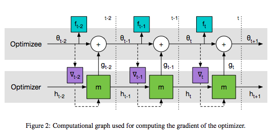

# LearningToLearn: RNN-based Optimization 

TensorFlow implementation of [Learning to learn by gradient descent by gradient descent](https://arxiv.org/pdf/1606.04474v1.pdf). 

Since the computational graph of the architecture could be huge on MNIST and Cifar10, the current implementation only deals with the task
on quadratic functions as described in Section 3.1 in the paper. The image below is from the paper (Figure 2 on page 4).



## Requirements

- Python 2.7 or higher
- Numpy 
- Tensorflow 0.9 


## Usage

First train a rnn optimizer:
```
$ python trainOptimizer.py 
```
which outputs variable_dict.pickle, model-0-0, and model-0-0.meta. Note that graph compilation at the begnning might take a while depending on the parameters.

variable_dict.pickle contains the parameters of the rnn optimizer, which is to be used 
in the construction of the training graph in main.py.

Note that unless the loss at the end is around 2.0 ~ 4.0, the RNN will not correctly update the parameters in main.py, so 
if you get more than 4.0, you might want to re-train the rnn oprimizer. 

Then, run
```
$ python main.py
```

The parameters in this model are: 

| params        | |default       | in the paper |
|:-------------:|---- |:-------------:|:--:|
| n_samplings   |number of random function samplings |10 |100 |
| n_unroll      |number of steps to unroll in BPTT |20     |20|
| n_dimension   |the dimension of input data space |3      |10|
| n_hidden      |number of hidden units in RNN |5             |20|
| n_layers      |number of RNN layers |2             | 2|
| max_epoch     | only for main.py    | 20 | NA |
| optim_method  | only for main.py    | 'lstm' | 'lstm' |

You can change these values by passing the arguments explicitly. For example:
```
$ python3 trainOptimizer.py --n_samplings 10 --n_unroll 4 --n_dimension 5 --n_hidden 3 --n_layers 2
```

Make sure you use the same values for both trainOptimizer.py and main.py. 

Instead of manually running the two python scripts, you can also run runall.sh to do the same. One run of runall.sh should be done in around 5 minutes with the default setting.

## Reference

[Learning to learn by gradient descent by gradient descent](https://arxiv.org/pdf/1606.04474v1.pdf)


## LICENSE   

MIT License


